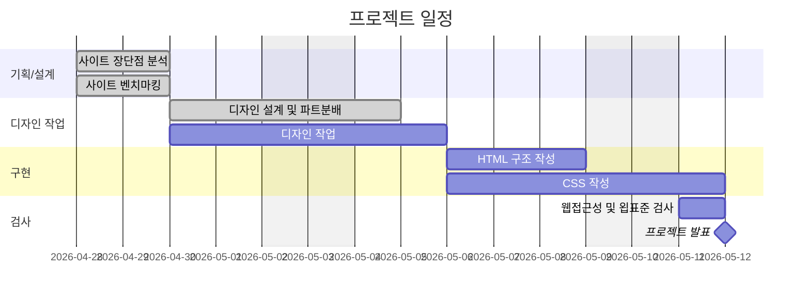

# (1차 프로젝트)

- 과정명: 오르미 프론트엔드 개발자 부트캠프
- 기간: 2026/04/30 ~ 2026/05/12

## 빠른 링크

## 1. 프로젝트 개요

### 1.1 목표

- 이스트소프트 교육 모집 웹페이지 개선

### 1.2 팀원

|  이름  | 역할 |                          주요 담당                          |                           GitHub                           |                       이메일                       |
| :----: | :--: | :---------------------------------------------------------: | :--------------------------------------------------------: | :------------------------------------------------: |
| 유태구 | 팀장 |     HTML 및 CSS <br/> (헤더, 히어로, 수강생 취업 현황)      |       [@rozer4heros](https://github.com/rozer4heros)       |   [rozer4heros@gmail.com](rozer4heros@gmail.com)   |
| 박소영 | 팀원 |    HTML 및 CSS <br/> (위 슬로건, 수강 혜택, 홍보용 통계)    |              [@s0-p](https://github.com/s0-p)              |      [b00v0429@gmail.com](b00v0429@gmail.com)      |
| 조승아 | 팀원 |    HTML 및 CSS <br/> (수강 후기, 수강 요건, 아래 슬로건)    |    [@eodrn7021-cell](https://github.com/eodrn7021-cell)    |     [eodrn7021@gmail.com](eodrn7021@gmail.com)     |
| 박채원 | 팀원 |  HTML 및 CSS <br/> (사이드 nav, 강좌 목록, 대상 고객 안내)  |       [@chaewon5205](https://github.com/chaewon5205)       | [parkjihae9262@gmail.com](parkjihae9262@gmail.com) |
| 권유진 | 팀원 | HTML 및 CSS <br/> (이스트캠프 콘텐트, FAQ, 신청 마감, 푸터) | [@rwonyujin03-debug](https://github.com/rwonyujin03-debug) |   [rwonyujin03@gmail.com](rwonyujin03@gmail.com)   |

### 1.3 프로젝트 일정



## 2. 개발 환경 및 배포

### 2.1 개발 스택

Frontend

- Structure: HTML
- Styling: CSS

Tools

- Version Control: Git & GitHub
- Code Editor : Visual Studio Code
- Design: Figma

### 2.2 URL

- [https://rozer4heros.github.io/est_fe_13_1st_project/](https://rozer4heros.github.io/est_fe_13_1st_project/)

## 3. 프로젝트 구조

> est_fe_13_1st_project/ <br/>
> ├─ .vscode/ <br/>
> ├─ css/ <br/>
> │ ├─ common.css <br/>
> │ ├─ index.css <br/>
> │ ├─ flex-utility.css <br/>
> │ ├─ normalize.css <br/>
> │ └─ reset.css <br/>
> ├─ image/ <br/>
> ├─ common.html # 사이트 전역/반복 사용 요소 보관소 <br/>
> ├─ index.html <br/>
> └─ README.md '''

## 4. 향후 개선 사항

- 동적 요소 미구현

## 5. 제작 후기

- 유태구: Git 관리를 하면서 애매하거나 잘 모르는 부분은 AI를 활용해 클래스명 작명법, 커밋 메시지 작성법, 어려운 문제 해결 방법을 배우고 나아가 팀에 대한 책임감도 기르는 시간을 가질 수 있었습니다.

## 6. 기획/디자인 문서

- [기획 슬라이드(피그마 슬라이드)](https://www.figma.com/slides/NsGzmNRyeujiGmuqMgXBxt):
- [디자인 시안(피그마)](https://www.figma.com/design/bUzmsPXP15RsPYMmtjsPpp/%EB%94%94%EC%9E%90%EC%9D%B8-%EC%8B%9C%EC%95%88?node-id=0-1&t=aNipptFfc3rsLdrL-1):

```

```
